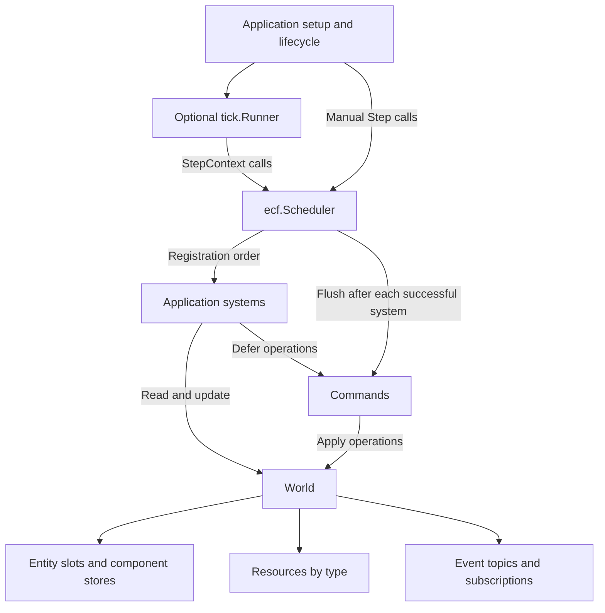

# Architecture

ECF is an in-memory entity-component framework for Go game servers. A `World`
holds simulation state, a `Scheduler` executes systems in a fixed order, and the
optional `tick` package maps elapsed wall time to fixed simulation steps.
Applications supply game rules, transport, persistence, and process lifecycle.

The module is `github.com/qattidev/ecf`. [go.mod](go.mod) declares Go 1.25.11;
all Go packages use only the standard library and this module. See
[README.md](README.md) for API usage and runnable examples.

## Package boundaries

| Location | Responsibility |
| --- | --- |
| [world.go](world.go) | World ownership, entity allocation, lifetime validation, and component registry. |
| [component.go](component.go), [query.go](query.go) | Typed component storage, reusable views, filters, and iteration guards. |
| [scheduler.go](scheduler.go), [commands.go](commands.go) | Ordered systems, simulation time, deferred operations, and failure handling. |
| [resource.go](resource.go), [event.go](event.go) | Shared values and bounded event subscriptions within one world. |
| [tick/runner.go](tick/runner.go) | Optional wall-clock pacing, bounded catch-up, cancellation, and batch statistics. |
| [examples/](examples/) | Applications that compose the framework with game logic and external input/output. |
| [.github/workflows/ci.yml](.github/workflows/ci.yml) | Formatting, tests, race detection, vet, and executable example checks. |

The root files form the `ecf` package. `ecf/tick` imports `ecf`; the core has no
dependency on the runner or examples. Worlds can be used directly, and schedulers
can be stepped manually without a timer.

## Ownership and concurrency

A world and everything obtained from it are used by one goroutine at a time.
This includes component pointers, queries, resources, subscriptions, schedulers,
and command buffers. Construct worlds with `NewWorld`; these objects must not be
copied. The library does not synchronize access to simulation state.

Independent worlds can run concurrently. The process-wide atomic world ID
allocator keeps their entity identities distinct. The runner also uses an atomic
flag to reject overlapping `Run` calls on the same runner; that flag does not
make its scheduler or world safe for concurrent access.

Applications own goroutines and communication channels. An early system can
drain a bounded amount of input, while a later system builds snapshots for other
goroutines. Components, resources, and events retain ordinary Go aliasing:
copying a struct containing a map, slice, or pointer does not copy its referenced
data. Transfer owned values, copy referenced data when necessary, and keep
borrowed ECS pointers on the simulation goroutine.

## Entity and component storage

An `Entity` is a comparable handle containing a world ID, a slot index, and a
generation. `World` stores slot metadata, a free-slot stack, and a live count.
`Alive` validates all three handle fields against the slot's current state.
Zero, dead, and foreign handles are invalid.

Creating an entity reuses a free slot or appends a new one. Destroying it removes
its components from every populated store, marks the slot dead, and increments
its generation before recycling the index. A slot at generation exhaustion is
retired, preventing an old handle from becoming valid again. World ID exhaustion
also fails instead of wrapping. Entity handles are local runtime identities;
applications define their own persistent and network IDs.

Each component type has a `storage[T]` with three slices:

| Slice | Contents |
| --- | --- |
| `entities` | Dense entity handles for this component type. |
| `values` | Dense `T` values aligned with `entities`. |
| `sparse` | Entity slot index to dense index plus one; zero means absent. |

The world locates stores through `reflect.Type` keys. Within a store, lookup
uses the sparse index and checks the complete entity handle. Replacement writes
in place. Addition appends to dense storage and extends the sparse slice as
needed. Removal moves the last entry into the removed entry's position, repairs
its sparse index, and clears the vacated values to release references.

Lookup and removal within a store take constant time; dense appends are
amortized constant time, with additional work when the sparse slice grows.
Destroying an entity scans the component registry. Sparse slices retain their
length after removals, so memory use depends partly on the highest entity index
stored for each type. Swap removal also makes entity iteration order unstable.

## Query execution and mutation

`Query1` through `Query4` create typed views that retain pointers to component
stores. Filters retain stable `componentEntry` references, allowing `With` and
`Without` to observe stores first populated after query construction. Queries
cache access paths and observe current membership on every traversal.

Each `Each` call chooses the smallest required store, including additional
`With` filters, as its iteration source. It checks each candidate against all
required and excluded types, then passes pointers into dense values to the
callback. A missing `With` store produces no matches. Returning `false` stops
iteration. Type resolution happens during construction; the traversal itself
does no reflection or type-map lookup and needs no allocations after setup,
apart from any work the application callback performs.

The world tracks nested traversals with `queryDepth`. While a query is active,
structural changes such as creating an entity, destroying a live entity, adding
a missing component, or removing a present component panic with
`ErrStructuralMutation`. Editing existing component values, including replacement
through `Set`, is allowed. Deferred cleanup restores the depth on early return
or panic, and nested queries keep the guard active until the outermost traversal
finishes.

These rules protect dense storage during traversal. Appends can reallocate it,
and removals can move values, so callers must reacquire `Get` pointers after
structural changes and must not retain query pointers beyond their callback.
Structural work requested during iteration belongs in a command buffer.

## Scheduling, commands, and failure

A scheduler owns a fixed positive step duration, an ordered list of systems,
one reusable `Frame`, and one command buffer for its world. Systems implement
`Update(*Frame) error`; `SystemFunc` adapts ordinary functions. Registration
requires unique nonempty names and freezes when the first tick starts. There
is no dependency graph or automatic parallel execution: registration order
defines when systems observe one another's changes.

A successful `StepContext` follows this sequence:

1. Check for an existing fault, reentrant stepping, context cancellation, an
   active query, and simulation-time overflow.
2. Start the tick and advance simulation time by the fixed step.
3. Walk systems in registration order, checking cancellation before each entry.
   Skip systems whose interval is not due.
4. Fill the borrowed frame and invoke the due system.
5. Flush its deferred commands before proceeding to the next system.
6. Clear pending commands and the borrowed frame when the step exits.

Ticks begin at 1, and `Frame.Time` is the end time of the current tick.
`Every(n)` runs a system on ticks `n`, `2n`, and so on; its `Frame.Delta` is
`n * step`, including its first invocation. Interval durations are checked for
overflow during registration. `Step()` uses a background context and never
sleeps. Systems doing long work must check `Frame.Context` themselves.

`Commands` holds FIFO `func(*World) error` operations. The scheduler flushes
after every successful system, so later systems see structural changes in the
same tick. Applications can also create standalone buffers and flush them after
queries finish. Commands should capture handles and values, since borrowed
component pointers may become invalid before execution. Enqueuing, clearing,
or recursively flushing the same buffer during a flush panics.

Operations apply immediately when executed, without rollback. A command error
or panic discards the remaining queue; standalone buffers can then be reused.
A system error discards its unflushed commands while preserving direct changes.
System or command failures permanently fault the scheduler, and returned errors
identify the system and tick. Panics propagate unchanged and leave
`ErrStepPanicked` recorded for subsequent calls.

Cancellation detected before a tick starts leaves the scheduler reusable.
Cancellation detected between systems faults the partially applied tick.
Simulation-time overflow also permanently faults the scheduler. `Tick()` and
`Time()` describe the most recently started tick, so callers must inspect `Err()`
before treating the world as the result of a completed step. Recovery and state
reconstruction belong to the application.

## Resources and events

Resources provide one shared value per Go type per world, stored as a `*T` in
a type-keyed map. Replacement updates the existing allocation, preserving
borrowed resource pointers. Removal detaches those pointers; a later insertion
creates a new allocation. Resource operations do not change component storage.

Event topics are also keyed by Go type. Each `Subscription[T]` owns an
independent bounded ring buffer for future events; zero capacity selects 1,024
entries and negative capacity is rejected. `Publish` first checks every
subscriber's capacity, then copies the event into each queue. If any queue is
full, it returns `ErrEventQueueFull` and delivers to nobody. Publishing with no
subscribers succeeds without retaining the event.

Delivery is synchronous on the owning goroutine. Later systems can read an
event in the same tick, and slower systems retain their copies across ticks.
There is no automatic event expiry or background dispatch. `Next` clears the
consumed slot; `Close` removes the subscriber and releases its unread events.
Applications must handle overflow and close unused subscriptions. Event copies
share any referenced data under the same aliasing rules as components.

## Wall-clock pacing

`tick.Runner.Run` blocks on its caller's goroutine. It creates no worker and
takes ownership of scheduler access for the duration of the call. Its private
clock interface uses `time.Now` and a reusable timer in production, and supports
fake-clock tests without exposing clock injection as public API.

The runner accumulates monotonic elapsed time. The first tick becomes due after
one step duration; whenever enough backlog is available, it executes fixed
steps up to `MaxCatchUpSteps` per batch, defaulting to five. It then discards
remaining whole-step backlog and retains the fractional remainder. Discarded
wall time does not advance simulation ticks or enlarge `Frame.Delta`, so
sustained overload slows simulation relative to wall time.

System execution and `OnBatch` callback time count toward the next deadline.
`OnBatch` receives completed step count, execution duration, and dropped backlog
on the same goroutine, including reports for failed batches. The callback must
not step the scheduler and should finish quickly. A run stopped at a clean tick
boundary can resume with the same simulation counters and a fresh wall-clock
baseline. A faulted scheduler cannot resume.

Fixed durations and ordered systems make execution explicit, but reproducible
replay also depends on application inputs, iteration order, and numerical
behavior. The framework does not guarantee bit-exact replay or equivalent
results across different tick rates.

## Application integration

The [combat](examples/combat/main.go) example combines manually driven ticks,
damage events, deferred destruction, and a slower audit reader.
[Economy](examples/economy/main.go) demonstrates a shared rules resource and
interval-based production. [Worlds](examples/worlds/main.go) runs independent
20 Hz and 60 Hz simulations on separate goroutines, using channels for inputs
and copied snapshots for output.

The [Pong example](examples/pong/README.md) provides a complete transport and
rendering boundary around a single authoritative world:

| Location | Responsibility |
| --- | --- |
| [main.go](examples/pong/main.go) | Configure the server, start HTTP and simulation goroutines, and coordinate cancellation and shutdown. |
| [game.go](examples/pong/game.go) | Define components, a match resource, cached queries, physics, bots, scoring, and snapshot values. |
| [hub.go](examples/pong/hub.go) | Own client membership and seats, consume actions, and distribute snapshots. |
| [server.go](examples/pong/server.go) | Validate HTTP requests, manage SSE connections, and serve embedded assets. |
| [web/app.js](examples/pong/web/app.js) | Send controls, receive snapshots, interpolate positions, and render the Canvas client. |

The hub registers `network inputs`, `pong simulation`, and `browser snapshots`
in that order. HTTP handlers submit actions through a channel with capacity 128
and wait for acknowledgments. The first system processes at most 128 actions
per tick, bounding network work before simulation. Membership, sequence checks,
seat assignment, and controls are updated on the world-owning goroutine.

The simulation uses physics substeps of at most 1/240 second inside each fixed
tick. The output system creates snapshots containing values and fixed arrays;
each client has a one-element channel whose stale snapshot is replaced when
necessary. Slow browsers therefore do not block simulation. At the default
60 Hz tick rate, scheduled snapshots run every second tick. Joins and departures
also trigger broadcasts.

The browser receives a connection-scoped session token through
`GET /api/events`, submits controls and restarts through HTTP POST requests, and
receives state over server-sent events. HTTP goroutines serialize copied
snapshots without reading world storage. HTML, CSS, and JavaScript are embedded
in the Go executable, so there is no frontend build dependency. The example
keeps one court in memory; accounts, lobbies, and persistence are outside it.

Reusable game packages can follow the same composition pattern: define types,
construct queries and subscriptions during setup, and register systems in an
explicit order. The application owns subscription cleanup, runner shutdown,
network protocols, and persistence. ECF supplies no plugin lifecycle interface.

## Verification

The tests exercise the architectural contracts alongside their implementations:

| Tests | Coverage |
| --- | --- |
| [world_test.go](world_test.go) | Handle lifetime and isolation, storage compaction, late filter stores, nested queries, mutation guards, allocation checks, and comparison with a reference model. |
| [scheduler_test.go](scheduler_test.go), [commands_test.go](commands_test.go) | Ordering, intervals, command visibility, partial failures, panics, cancellation, reentry, and concurrent independent worlds. |
| [event_test.go](event_test.go) | Broadcast overflow, FIFO behavior, subscription cleanup, type/world isolation, and resource pointer semantics. |
| [tick/runner_test.go](tick/runner_test.go) | First deadlines, bounded catch-up, fractional backlog, execution and observer time, failures, and cancellation using a fake clock. |
| [examples/pong/](examples/pong/) | Game behavior, client seats, input ordering, HTTP validation and streams, embedded assets, and server shutdown. |

CI runs `go test -timeout=60s ./...`, the same suite with `-race`, `go vet ./...`,
formatting checks, and the combat, economy, and concurrent-world examples.
[benchmark_test.go](benchmark_test.go) measures component operations and full
query traversals at 1,000, 10,000, and 100,000 entities. The optional
[Pong browser smoke test](examples/pong/browser-test.mjs) uses Node and Chrome's
DevTools protocol; its setup is documented in the Pong README and it is not
part of CI.
